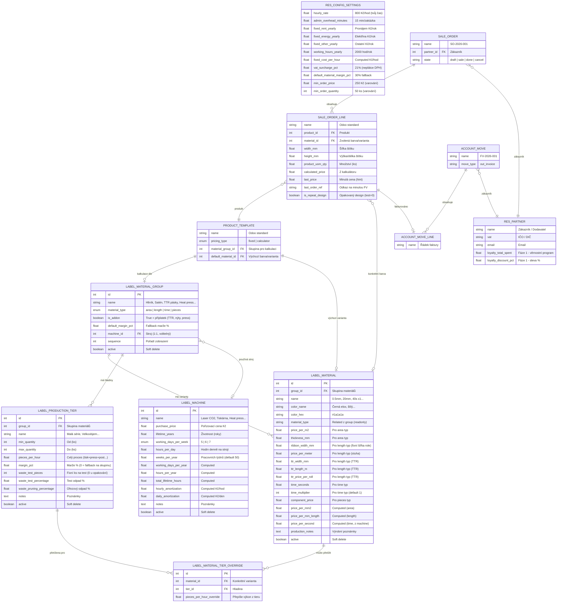

```mermaid
erDiagram
    %% ═══════════════════════════════════════════
    %% NAŠE MODELY (label_calculator modul)
    %% ═══════════════════════════════════════════

    LABEL_MATERIAL_GROUP ||--o{ LABEL_MATERIAL : "má varianty"
    LABEL_MATERIAL_GROUP ||--o{ LABEL_PRODUCTION_TIER : "má hladiny"
    LABEL_MATERIAL_GROUP }o--o| LABEL_MACHINE : "používá stroj"

    LABEL_MATERIAL ||--o{ LABEL_MATERIAL_TIER_OVERRIDE : "může přetížit"
    LABEL_PRODUCTION_TIER ||--o{ LABEL_MATERIAL_TIER_OVERRIDE : "přetížena pro"

    LABEL_MATERIAL_GROUP {
        int id PK
        string name "Hliník, Satén, TTR pásky, Heat press..."
        enum material_type "area | length | time | pieces"
        boolean is_addon "True = příplatek (TTR, nýty, press)"
        float default_margin_pct "Fallback marže %"
        int machine_id FK "Stroj (1:1, volitelný)"
        int sequence "Pořadí zobrazení"
        boolean active "Soft delete"
    }

    LABEL_MATERIAL {
        int id PK
        int group_id FK "Skupina materiálů"
        string name "0.5mm, 20mm, 40s x1..."
        string color_name "Černá elox, Bílý..."
        string color_hex "#1a1a1a"
        string material_type "Related z group (readonly)"
        float price_per_m2 "Pro area typ"
        float thickness_mm "Pro area typ"
        float ribbon_width_mm "Pro length typ (fixní šířka role)"
        float price_per_meter "Pro length typ (stuha)"
        float ttr_width_mm "Pro length typ (TTR)"
        float ttr_length_m "Pro length typ (TTR)"
        float ttr_price_per_roll "Pro length typ (TTR)"
        float time_seconds "Pro time typ"
        int time_multiplier "Pro time typ (default 1)"
        float component_price "Pro pieces typ"
        float price_per_mm2 "Computed (area)"
        float price_per_mm_length "Computed (length)"
        float price_per_second "Computed (time, z machine)"
        text production_notes "Výrobní poznámky"
        boolean active "Soft delete"
    }

    LABEL_PRODUCTION_TIER {
        int id PK
        int group_id FK "Skupina materiálů"
        string name "Malá série, Velkoobjem..."
        int min_quantity "Od (ks)"
        int max_quantity "Do (ks)"
        float pieces_per_hour "Celý proces (tisk+press+post...)"
        float margin_pct "Marže % (0 = fallback na skupinu)"
        int waste_test_pieces "Fixní ks na test (0 u opakování)"
        float waste_test_percentage "Test odpad %"
        float waste_pruning_percentage "Ořezový odpad %"
        text notes "Poznámky"
        boolean active "Soft delete"
    }

    LABEL_MACHINE {
        int id PK
        string name "Laser CO2, Tiskárna, Heat press..."
        float purchase_price "Pořizovací cena Kč"
        float lifetime_years "Životnost (roky)"
        enum working_days_per_week "5 | 6 | 7"
        float hours_per_day "Hodin denně na stroji"
        float weeks_per_year "Pracovních týdnů (default 50)"
        float working_days_per_year "Computed"
        float hours_per_year "Computed"
        float total_lifetime_hours "Computed"
        float hourly_amortization "Computed Kč/hod"
        float daily_amortization "Computed Kč/den"
        text notes "Poznámky"
        boolean active "Soft delete"
    }

    LABEL_MATERIAL_TIER_OVERRIDE {
        int id PK
        int material_id FK "Konkrétní varianta"
        int tier_id FK "Hladina"
        float pieces_per_hour_override "Přepíše výkon z tieru"
    }

    %% ═══════════════════════════════════════════
    %% GLOBÁLNÍ NASTAVENÍ (res.config.settings)
    %% ═══════════════════════════════════════════

    RES_CONFIG_SETTINGS {
        float hourly_rate "800 Kč/hod (tvůj čas)"
        float admin_overhead_minutes "15 min/zakázka"
        float fixed_rent_yearly "Pronájem Kč/rok"
        float fixed_energy_yearly "Elektřina Kč/rok"
        float fixed_other_yearly "Ostatní Kč/rok"
        float working_hours_yearly "2000 hod/rok"
        float fixed_cost_per_hour "Computed Kč/hod"
        float vat_surcharge_pct "21% (neplátce DPH)"
        float default_material_margin_pct "30% fallback"
        float min_order_price "250 Kč (varování)"
        int min_order_quantity "50 ks (varování)"
    }

    %% ═══════════════════════════════════════════
    %% ROZŠÍŘENÍ ODOO MODELŮ (Fáze 1 - později)
    %% ═══════════════════════════════════════════

    PRODUCT_TEMPLATE ||--o| LABEL_MATERIAL_GROUP : "kalkulace dle"
    PRODUCT_TEMPLATE ||--o| LABEL_MATERIAL : "výchozí varianta"

    PRODUCT_TEMPLATE {
        string name "Odoo standard"
        enum pricing_type "fixed | calculator"
        int material_group_id FK "Skupina pro kalkulaci"
        int default_material_id FK "Výchozí barva/varianta"
    }

    SALE_ORDER_LINE }o--|| PRODUCT_TEMPLATE : "produkt"
    SALE_ORDER_LINE }o--o| LABEL_MATERIAL : "konkrétní barva"

    SALE_ORDER_LINE {
        string name "Odoo standard"
        int product_id FK "Produkt"
        int material_id FK "Zvolená barva/varianta"
        float width_mm "Šířka štítku"
        float height_mm "Výška/délka štítku"
        float product_uom_qty "Množství (ks)"
        float calculated_price "Z kalkulátoru"
        float last_price "Minulá cena (hint)"
        string last_order_ref "Odkaz na minulou FV"
        boolean is_repeat_design "Opakovaný design (test=0)"
    }

    %% ═══════════════════════════════════════════
    %% ODOO STANDARD (neměníme)
    %% ═══════════════════════════════════════════

    RES_PARTNER {
        string name "Zákazník / Dodavatel"
        string vat "IČO / DIČ"
        string email "Email"
        float loyalty_total_spent "Fáze 1 - věrnostní program"
        float loyalty_discount_pct "Fáze 1 - sleva %"
    }

    SALE_ORDER ||--o{ SALE_ORDER_LINE : "obsahuje"
    SALE_ORDER }o--|| RES_PARTNER : "zákazník"

    SALE_ORDER {
        string name "SO-2026-001"
        int partner_id FK "Zákazník"
        string state "draft | sale | done | cancel"
    }

    ACCOUNT_MOVE ||--o{ ACCOUNT_MOVE_LINE : "obsahuje"
    ACCOUNT_MOVE }o--|| RES_PARTNER : "zákazník"

    ACCOUNT_MOVE {
        string name "FV-2026-001"
        string move_type "out_invoice"
    }

    ACCOUNT_MOVE_LINE {
        string name "Řádek faktury"
    }

    SALE_ORDER_LINE ||--o| ACCOUNT_MOVE_LINE : "fakturováno"
```