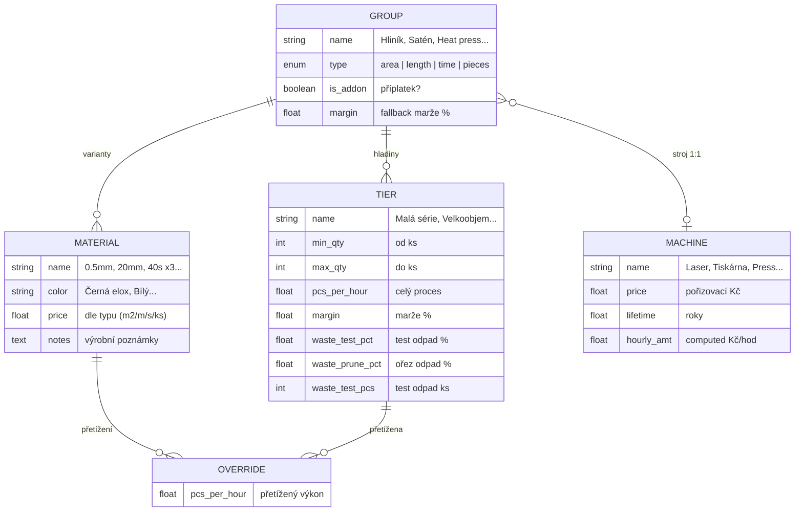

```mermaid
erDiagram
    GROUP ||--o{ MATERIAL : "varianty"
    GROUP ||--o{ TIER : "hladiny"
    GROUP }o--o| MACHINE : "stroj 1:1"
    MATERIAL ||--o{ OVERRIDE : "přetížení"
    TIER ||--o{ OVERRIDE : "přetížena"

    GROUP {
        string name "Hliník, Satén, Heat press..."
        enum type "area | length | time | pieces"
        boolean is_addon "příplatek?"
        float margin "fallback marže %"
    }

    MATERIAL {
        string name "0.5mm, 20mm, 40s x3..."
        string color "Černá elox, Bílý..."
        float price "dle typu (m2/m/s/ks)"
        text notes "výrobní poznámky"
    }

    TIER {
        string name "Malá série, Velkoobjem..."
        int min_qty "od ks"
        int max_qty "do ks"
        float pcs_per_hour "celý proces"
        float margin "marže %"
        float waste_test_pct "test odpad %"
        float waste_prune_pct "ořez odpad %"
        int waste_test_pcs "test odpad ks"
    }

    MACHINE {
        string name "Laser, Tiskárna, Press..."
        float price "pořizovací Kč"
        float lifetime "roky"
        float hourly_amt "computed Kč/hod"
    }

    OVERRIDE {
        float pcs_per_hour "přetížený výkon"
    }
```