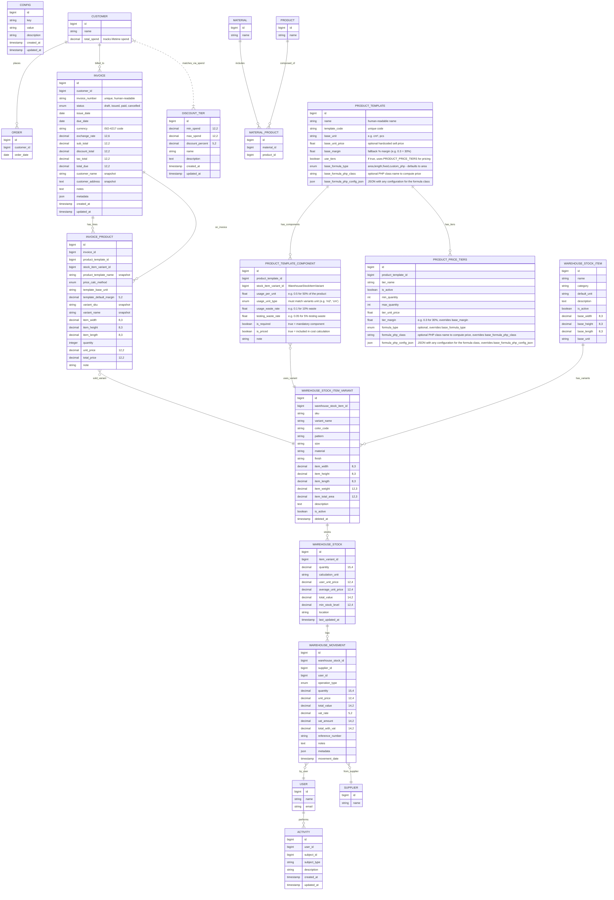

```mermaid
erDiagram
    %% Users, Activities & Config
    USER ||--o{ ACTIVITY           : performs
    USER {
        bigint id
        string name
        string email
        %% …other user fields
    }
    ACTIVITY {
        bigint id
        bigint user_id
        bigint subject_id
        string subject_type
        string description
        timestamp created_at
        timestamp updated_at
    }
    CONFIG {
        bigint id
        string key
        string value
        string description
        timestamp created_at
        timestamp updated_at
    }

    %% Customers, Orders, Invoices & Discounts
    CUSTOMER ||--o{ ORDER             : places
    CUSTOMER ||--o{ INVOICE           : billed_to
    CUSTOMER }|..|{ DISCOUNT_TIER      : matches_via_spend
    CUSTOMER {
        bigint id
        string name
        decimal total_spend      "tracks lifetime spend"
        %% …other customer fields
    }
    ORDER {
        bigint id
        bigint customer_id
        date   order_date
        %% …other order fields
    }
    INVOICE ||--o{ INVOICE_PRODUCT   : has_lines
    INVOICE {
        bigint id
        bigint customer_id
        string invoice_number            "unique, human‐readable"
        enum   status                    "draft, issued, paid, cancelled"
        date   issue_date
        date   due_date
        string currency                  "ISO-4217 code"
        decimal exchange_rate            "12,6"
        decimal sub_total                "12,2"
        decimal discount_total           "12,2"
        decimal tax_total                "12,2"
        decimal total_due                "12,2"
        string customer_name             "snapshot"
        text   customer_address          "snapshot"
        text   notes
        json   metadata
        timestamp created_at
        timestamp updated_at
    }
    DISCOUNT_TIER {
        bigint id
        decimal min_spend               "12,2"
        decimal max_spend               "12,2"
        decimal discount_percent        "5,2"
        string  name
        text    description
        timestamp created_at
        timestamp updated_at
    }

    %% Products, Materials & Pivot
    MATERIAL ||--o{ MATERIAL_PRODUCT  : includes
    PRODUCT  ||--o{ MATERIAL_PRODUCT  : composed_of
    MATERIAL_PRODUCT {
        bigint id
        bigint material_id
        bigint product_id
    }
    MATERIAL {
        bigint id
        string name
    }
    PRODUCT {
        bigint id
        string name
    }

    %% Product Templates & Pricing
    PRODUCT_TEMPLATE ||--o{ PRODUCT_TEMPLATE_COMPONENT : has_components
    PRODUCT_TEMPLATE ||--o{ PRODUCT_PRICE_TIERS        : has_tiers
    PRODUCT_TEMPLATE {
        bigint id
        string name "human-readable name"
        string template_code "unique code"
        string base_unit               "e.g. cm², pcs"
        float  base_unit_price   "optional hardcoded sell price"
        float  base_margin       "fallback % margin (e.g. 0.3 = 30%)"
        boolean use_tiers   "if true, uses PRODUCT_PRICE_TIERS for pricing"
        enum   base_formula_type       "area,length,fixed,custom_php - defaults to area"
        string base_formula_php_class   "optional PHP class name to compute price"
        json   base_formula_php_config_json "JSON with any configuration for the formula class"
    }
    PRODUCT_TEMPLATE_COMPONENT }o--|| WAREHOUSE_STOCK_ITEM_VARIANT : uses_variant
    PRODUCT_TEMPLATE_COMPONENT {
        bigint id
        bigint product_template_id
        bigint stock_item_variant_id "WarehouseStockItemVariant"
        float  usage_per_unit "e.g. 0.5 for 50% of the product"
        enum   usage_unit_type     "must match variants unit (e.g. 'm2', 'cm')"
        float  usage_waste_rate "e.g. 0.1 for 10% waste"
        float  testing_waste_rate "e.g. 0.05 for 5% testing waste"
        boolean is_required   "true = mandatory component"
        boolean is_priced     "true = included in cost calculation"
        string note
    }
    PRODUCT_PRICE_TIERS {
        bigint id
        bigint product_template_id
        string  tier_name
        boolean is_active
        int     min_quantity
        int     max_quantity
        float   tier_unit_price
        float   tier_margin  "e.g. 0.3 for 30%, overrides base_margin"  
        enum    formula_type           "optional, overrides base_formula_type"
        string  formula_php_class  "optional PHP class name to compute price, overrides base_formula_php_class"
        json    formula_php_config_json "JSON with any configuration for the formula class, overrides base_formula_php_config_json"
    }

    %% Invoice Line Items
    INVOICE_PRODUCT }o--|| INVOICE                          : on_invoice
    INVOICE_PRODUCT }o--|| WAREHOUSE_STOCK_ITEM_VARIANT     : sold_variant
    INVOICE_PRODUCT {
        bigint id
        bigint invoice_id
        bigint product_template_id
        bigint stock_item_variant_id
        string  product_template_name   "snapshot"
        enum    price_calc_method
        string  template_base_unit
        decimal template_default_margin "5,2"
        string  variant_sku             "snapshot"
        string  variant_name            "snapshot"
        decimal item_width              "8,3"
        decimal item_height             "8,3"
        decimal item_length             "8,3"
        integer quantity
        decimal unit_price              "12,2"
        decimal total_price             "12,2"
        string  note
    }

    %% Warehouse Inventory & Movements
    WAREHOUSE_STOCK_ITEM ||--o{ WAREHOUSE_STOCK_ITEM_VARIANT : has_variants
    WAREHOUSE_STOCK_ITEM {
        bigint id
        string name
        string category
        string default_unit
        text   description
        boolean is_active
        decimal base_width             "8,3"
        decimal base_height            "8,3"
        decimal base_length            "8,3"
        string base_unit
    }
    WAREHOUSE_STOCK_ITEM_VARIANT ||--o{ WAREHOUSE_STOCK      : stocks
    WAREHOUSE_STOCK_ITEM_VARIANT {
        bigint id
        bigint warehouse_stock_item_id
        string sku
        string variant_name
        string color_code
        string pattern
        string size
        string material
        string finish
        decimal item_width             "8,3"
        decimal item_height            "8,3"
        decimal item_length            "8,3"
        decimal item_weight            "12,3"
        decimal item_total_area        "12,3"
        text    description
        boolean is_active
        timestamp deleted_at
    }
    WAREHOUSE_STOCK ||--o{ WAREHOUSE_MOVEMENT            : logs
    WAREHOUSE_STOCK {
        bigint id
        bigint item_variant_id
        decimal quantity               "15,4"
        string  calculation_unit
        decimal user_unit_price        "12,4"
        decimal average_unit_price     "12,4"
        decimal total_value            "14,2"
        decimal min_stock_level        "12,4"
        string  location
        timestamp last_updated_at
    }
    WAREHOUSE_MOVEMENT }o--|| USER                          : by_user
    WAREHOUSE_MOVEMENT }o--|| SUPPLIER                     : from_supplier
    WAREHOUSE_MOVEMENT {
        bigint id
        bigint warehouse_stock_id
        bigint supplier_id
        bigint user_id
        enum   operation_type
        decimal quantity               "15,4"
        decimal unit_price             "12,4"
        decimal total_value            "14,2"
        decimal vat_rate               "5,2"
        decimal vat_amount             "14,2"
        decimal total_with_vat         "14,2"
        string  reference_number
        text    notes
        json    metadata
        timestamp movement_date
    }
    SUPPLIER {
        bigint id
        string name
        %% …other supplier fields
    }
```