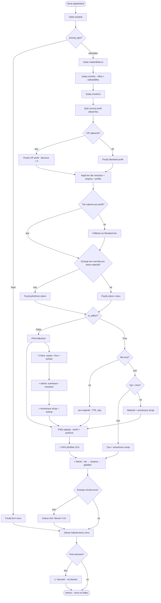

```mermaid
flowchart TD
    START([Nová objednávka]) --> SELECT_PRODUCT[Vyber produkt]
    SELECT_PRODUCT --> CHECK_TYPE{pricing_type?}

    CHECK_TYPE -->|fixed| FIXED_PRICE[Použij fixní cenu]
    CHECK_TYPE -->|calculator| SELECT_MATERIAL[Vyber materiál/barvu]

    SELECT_MATERIAL --> ENTER_DIMS[Zadej rozměry - šířka × výška/délka]
    ENTER_DIMS --> ENTER_QTY[Zadej množství]

    ENTER_QTY --> RESOLVE_PROFILE[Zjisti cenový profil zákazníka]
    RESOLVE_PROFILE --> CHECK_VIP{VIP zákazník?}
    CHECK_VIP -->|ano| USE_VIP_PROFILE[Použij VIP profil - discount = 0]
    CHECK_VIP -->|ne| USE_STD_PROFILE[Použij Standard profil]

    USE_VIP_PROFILE --> FIND_TIER[Najdi tier dle množství + skupiny + profilu]
    USE_STD_PROFILE --> FIND_TIER

    FIND_TIER --> CHECK_TIER_FOUND{Tier nalezen pro profil?}
    CHECK_TIER_FOUND -->|ano| CHECK_OVERRIDE{Existuje tier override pro tento materiál?}
    CHECK_TIER_FOUND -->|ne| FALLBACK[Fallback na Standard tier]
    FALLBACK --> CHECK_OVERRIDE

    CHECK_OVERRIDE -->|ano| USE_OVERRIDE[Použij přetížený výkon]
    CHECK_OVERRIDE -->|ne| USE_TIER[Použij výkon z tieru]

    USE_OVERRIDE --> CHECK_ADDON{is_addon?}
    USE_TIER --> CHECK_ADDON

    CHECK_ADDON -->|False| CALC_FULL[Plná kalkulace]
    CHECK_ADDON -->|True| CHECK_MACHINE{Má stroj?}

    CHECK_MACHINE -->|ne| CALC_MAT_ONLY[Jen materiál - TTR, nýty]
    CHECK_MACHINE -->|ano| CHECK_TIME{Typ = time?}

    CHECK_TIME -->|ano| CALC_TIME[Čas × amortizace stroje]
    CHECK_TIME -->|ne| CALC_MAT_AMORT[Materiál + amortizace stroje]

    CALC_FULL --> APPLY_WASTE[Přičti odpady - test% + prořez%]
    CALC_MAT_ONLY --> APPLY_WASTE
    CALC_MAT_AMORT --> APPLY_WASTE
    CALC_TIME --> APPLY_MARGIN

    APPLY_WASTE --> APPLY_VAT[× DPH přirážka 21%]
    APPLY_VAT --> APPLY_MARGIN[× Marže - tier → skupina → globální]

    CALC_FULL --> ADD_WORK[+ Práce: sazba + fixní ÷ ks/hod]
    ADD_WORK --> ADD_ADMIN[+ Admin: overhead ÷ množství]
    ADD_ADMIN --> ADD_MACHINE_AMORT[+ Amortizace stroje ÷ ks/hod]
    ADD_MACHINE_AMORT --> APPLY_WASTE

    APPLY_MARGIN --> CHECK_LAST{Existuje minulá cena?}
    CHECK_LAST -->|ano| SHOW_HINT[Zobraz hint: Minule X Kč]
    CHECK_LAST -->|ne| SHOW_PRICE

    SHOW_HINT --> SHOW_PRICE[Zobraz kalkulovanou cenu]
    FIXED_PRICE --> SHOW_PRICE

    SHOW_PRICE --> CHECK_MIN{Pod minimem?}
    CHECK_MIN -->|ano| SHOW_WARNING[⚠️ Varování - ne blocker]
    CHECK_MIN -->|ne| DONE

    SHOW_WARNING --> DONE([Hotovo - cena na řádku])
```